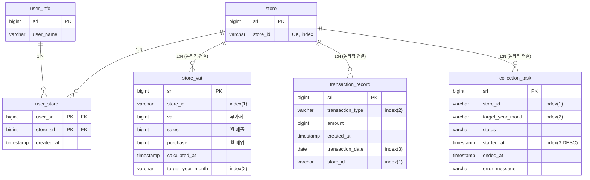

## [TaxController](./src/main/java/com/example/tax/adapter/in/web/TaxController.java) 
* 수집 요청 -> POST: /api/v1/tax  
* 수집 상태 조회 -> GET: /api/v1/tax/{storeId}/state?yearMonth=  
* 부가세 조회 API -> GET:  /api/v1/tax/{storeId}/vat?yearMonth=

## [StoreAccessManagementController](./src/main/java/com/example/tax/adapter/in/web/StoreAccessManagementController.java)
* 권한 부여 -> POST: /api/v1/stores/{storeId}/assignments?userSrl=, X-Admin-Role 헤더: ADMIN 
* 권한 회수 -> DELETE: /api/v1/stores/{storeId}/assignments?userSrl=, X-Admin-Role 헤더: ADMIN
* 권한 조회 -> GET: /api/v1/stores/{storeId}/permissions/me?userSrl=, X-Admin-Role 헤더: ADMIN or MANAGER

## DB' ERD Diagram

[//]: # (  )

* user_info: 사용자 정보
* store: 상점 정보
* user_store: 사용자-상점 간의 권한 관리를 위한 조인 테이블
* store_vat: 월 단위 매출/매입 합산 금액과 부가세를 저장
* transaction_record: sample.xlsx의 매출/매입 데이터를 저장하는 테이블
* collection_task: transaction_record 테이블에 저장하는 작업 단위의 진행 상태를 저장하는 테이블

